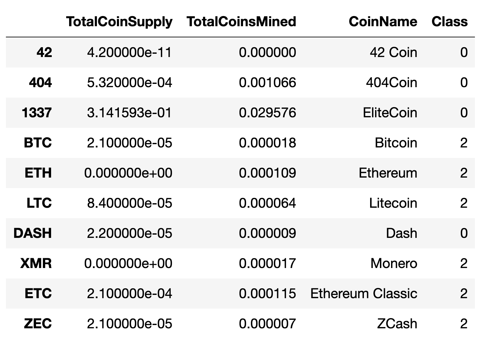

# **Cryptocurrencies**
Analyse Cryptocurrency data using unsupervised machine learning.
## Overview of the Project :
- A prominent investment bank, is interested in offering a new cryptocurrency investment portfolio for its customers and hence trying to analyse the vast universe of cryptocurrencies. To accomplish this task effectively and as there is no known output, data analytics team is deploying "Unsupervised machine learning" algorithm to create a report on available cryptocurrencies on the trading market and how they could be grouped to create a classification system.
## Unsupervised Machine learning :
- Unsupervised machine learning using Principal Component Analysis (PCA), Elbow Curve, K-Means Clustering Algorithm in Python.
- Python libraries used :
    - Pandas
    - sklearn preprocessing for StandardScaler and MinMaxScaler
    - sklearn decomposition for PCA
    - sklearn cluster for KMeans
    - plotly express and hvplot for visualizations
## Steps to accmmplish Unsupervised ML and Visualize :
- Preprocessing the Data for PCA : Perform various steps of cleaning and preprocessing the cryptocurrency data, transforming textual data to 98 different features, scaling the data using StandardScaler.
- Reducing the Data Dimensions using PCA : Use PCA algorithm to reduce 98 features to 3 principal components.
- Clustering Crytocurrencies using K-Means : Use Elbow curve to find the right number of clusters (found it to be 4 clusters), use K-Means to fit and predict 4 different clusters.
- Visualizing Crytocurrencies Results : Visualizing K-Means clusters on 3D graph, table of tradable cryptocurrencies using hvplot, Scatter plot using hvplot of TotalCoinsMined vs TotalCoinSupply (scaled using MinMaxScaler). Images of the visualizations are as follows :
- </img>
- </img>
- </img>
- </img>
- </img>
---
---